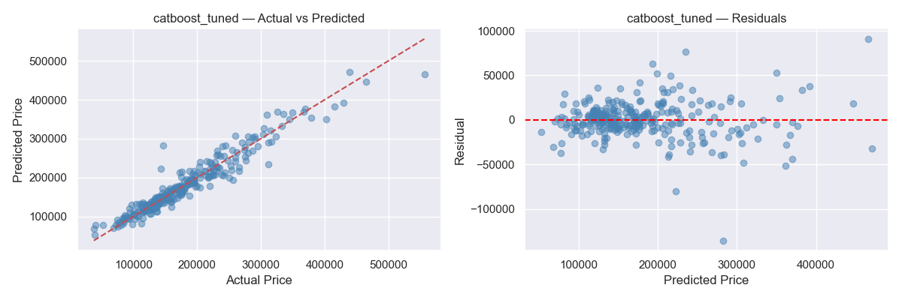

## Kaggle კონკურსის მიმოხილვა

Kaggle-ის კონკურსი House Prices, Iowa-ს 1460 სახლის 79 მახასიათებლის საფუძველზე გაყიდვის ფასის პროგნოზირებას. მთავარი მიზანია დავატრენინგოთ მოდელი, რომელიც პროგნოზს ვარაუდს მოგვცემს სახლის მოსალოდნელ ფასზე.

მიდგომა პრობლემის გადასაჭრელად:

ჩემს მთავარ მიდგომას წარმოადგენდა მონაცემების გამოკვლევა, განაწილებების, კორელაციების და outlier-ების პოვნა, ასევე გრაფიკების გამოყენება მონაცემთა კარგად ვიზაუალიზაციისათვის. თავდაპირველად გამოვიყენე მარტივი წრფივი მოდელები რაც რამდენიმე მიზანს ემსახურებოდა: პირველ რიგში, შევქმენი ე.წ. Baseline, ანუ საორიენტაციო წერტილი, რომელთან შედარებითაც შევაფასებდი ნებისმიერ მომდევნო რთულ ალგორითმს. წრფივი მოდელები ასევე დამეხმარა იმის დანახვაში, თუ რამდენად ეფექტური იყო ჩემს მიერ ჩატარებული Feature Engineering და რამდენად მგრძნობიარე იყო პროგნოზი რეგულარიზაციის პარამეტრების მიმართ. მას შემდეგ, რაც წრფივი მოდელებით მივაღწიე სტაბილურ შედეგს, გადავედი უფრო კომპლექსურ ალგორითმებზე.ეს მოდელები ავირჩიე იმისთვის, რომ დამეჭირა მონაცემებში არსებული არაწრფივი დამოკიდებულებები და ცვლადებს შორის რთული ინტერაქციები, რასაც სტანდარტული რეგრესია ვერ ამჩნევს. საბოლოო არჩევანი შევაჩერე CatBoost-ზე, რადგან მან აჩვენა საუკეთესო ბალანსი სიზუსტესა და განზოგადების უნარს შორის.

## რეპოზიტორიის სტრუქტურა

House-Prices:
    README.md -> პროექტის დეტალური აღწერა 
    model_experiment.ipynb -> ყველა ექსპერიმენტი, EDA, ტრენინგი და MLflow ლოგირება.
    model_inference.ipynb -> საუკეთესო მოდელის გამოყენება და პროგნოზების გენერაცია.
    feature_names.json -> Model Registry-სთვის შენახული feature სახელები
    skewed_features.json -> log1p ტრანსფორმაციისთვის შენახული skewed feature-ების სია
    train-ის სვეტების სია alignment-ისთვის
    lot_frontage_medians.json & garage_area_medians.json: ტრენინგზე დათვლილი მედიანები ინფერენსისთვის.

---

## Preprocessing & Feature Engineering

### კატეგორიული ცვლადების რიცხვითში გადაყვანა
თავდაპირველი ექსპერიმენტებისას გამოყენებული LabelEncoder-ი ქმნიდა ხელოვნურ იერარქიას იქ, სადაც ის არ არსებობდა (მაგ. უბნებს შორის), რაც აბნევდა წრფივ მოდელებს და აიძულებდა ხეებზე დაფუძნებულ მოდელებს გაეკეთებინათ არასწორი split-ები.ამის გამოსასწორებლად გამოვიყენე დიფერენცირებული ენკოდინგის სტრატეგია:

Ordinal Mapping: ხარისხობრივი მახასიათებლებისთვის (მაგ: ExterQual, KitchenQual), სადაც არსებობს ლოგიკური ზრდადობა (Poor → Excellent), გამოვიყენე ხელით განსაზღვრული Mapping-ი. ეს მოდელს საშუალებას აძლევს პირდაპირ აღიქვას ხარისხის გავლენა ფასზე, როგორც მონოტონური დამოკიდებულება.

One-Hot Encoding: ისეთი ცვლადებისთვის, რომლებსაც არ გააჩნიათ შინაგანი რიგითობა (მაგ: Neighborhood, Foundation), გამოვიყენე One-Hot Encoding. მოდელი აღარ პოულობს ცრუ კავშირებს და თითოეულ კატეგორიას მიეცა საშუალება, დამოუკიდებელი გავლენა იქონიოს პროგნოზზე.

განსაკუთრების გაუმჯობესდა არაწრფივი მოდელების სტაბილურობა

### NaN მნიშვნელობების დამუშავება

null მნიშვნელობებისათვის თითოეული სვეტი შევავსე მისი სემანტიკური შინაარსის გათვალისწინებით: 
კონტექსტური None-ის შევსება: ბევრ სვეტში (PoolQC, MiscFeature, Alley) NaN არ ნიშნავდა დაკარგულ ინფორმაციას, არამედ მიუთითებდა ობიექტის არარსებობაზე. მათი "None"-ით ჩანაცვლებამ მოდელს საშუალება მისცა, ეს ინფორმაცია ცალკე მახასიათებლად აღექვა.
Neighborhood Median გამოვიყენე ისეთი პარამეტრებისთვის, როგორიცაა LotFrontage, გამოვიყენე უბნის მიხედვით მედიანით შევსება. ეს ბევრად უფრო ზუსტია, ვიდრე გლობალური მედიანა, რადგან ერთ უბანში ნაკვეთების დაგეგმარება, როგორც წესი, იდენტურია. საბოლოოდ, სტატისტიკური Mode Fill, მცირე რაოდენობის გამოტოვებული კატეგორიული მნიშვნელობებისთვის გამოვიყენე ყველაზე ხშირი მნიშვნელობა (Mode), რამაც შეინარჩუნა მონაცემთა საერთო განაწილება. ამ მიდგომამ მნიშვნელოვნად შეამცირა ხმაური მონაცემებში.

### დამატებული feature-ები
ცალკეული სვეტები (პირველი სართული, მეორე სართული, სარდაფი) ხშირად დანაწევრებულ ინფორმაციას იძლევა. მათ გასაერთიანებლად შევქმენი აგრეგირებული მახასიათებლები. TotalArea / TotalBaths / TotalPorch ამ ცვლადების გაერთიანებით მოდელს საშუალება მიეცაა, დაენახა სახლის საერთო მასშტაბი, რაც ფასის უმთავრესი განმსაზღვრელია. ასევე შემქმენი OverallScore / LivArea_Qual, HouseAge & RemodAge, ბევრ მახასიათებელს აქვს „ნულოვანი“ მნიშვნელობების დიდი რაოდენობა ამიტომ შევქმენი ბინარული სვეტები (0 ან 1), რომლებიც მოდელს პირდაპირ ეუბნება, აქვს თუ არა სახლს კონკრეტული ელემენტი. ასევე გამოვიყენე ციკლური ენკოდინგი, ვინაიდან გაყიდვის თვის (MoSold) სტანდარტული რიცხვითი კოდირება (1-დან 12-მდე) პრობლემურია, რადგან მოდელი დეკემბერს 12 და იანვარს 1 აღიქვამს როგორც ერთმანეთისაგან შორს მყოფებ. 

## Cleaning მიდგომები

### Outliers და Log-Transformation

მონაცემების გასუფთავების ეტაპზე გამოვიყენე z-score მეთოდი (threshold=3), რამაც საშუალება მომცა ავტომატურად ამომეღო ის სტრიქონები, სადაც ნებისმიერი რიცხვითი სვეტი ექსტრემალურად გადახრილი იყო. ამ ნაბიჯმა RMSE დაახლოებით 27%-ით შეამცირა (25,820-მდე), რაც კიდევ ერთხელ ადასტურებს წრფივი მოდელების მგრძნობელობას აუთლაიერების მიმართ. 

ამის შემდეგ მივმართე np.log1p ტრანსფორმაციას SalePrice-ისთვის. ამან მონაცემთა განაწილება ნორმალურთან მიაახლოვა, რის შედეგადაც ცდომილება კიდევ 10%-ით შემცირდა.
ასევე გამოვიყენე Targeted outlier removal domain ცოდნაზე დაფუძნებული შერჩევა (GrLivArea, LotArea, SalePrice ანომალიები), რომელმაც მონაცემების დიდი ნაწილი შეინარჩუნა და უკეთ იმუშავა არაწრფივ მოდელებზე.

მოდელის სიზუსტის გაზრდის მიზნით, განვახორციელე მონაცემთა შევსების კომპლექსური სტრატეგია. იმ სვეტებში, სადაც NaN ნიშნავდა მახასიათებლის არარსებობას (მაგ: აუზი ან სარდაფი), გამოვიყენე "None" შევსება, ხოლო კატეგორიული სვეტებისთვის - Mode fill. განსაკუთრებული ყურადღება დავუთმე LotFrontage-ს, რომელიც მეზობელი უბნების (Neighborhood) მედიანით შევავსე. გარდა ამისა, შევქმენი ახალი, აგრეგირებული ფუნქციები: TotalArea, TotalBaths და HouseAge. ამ ცვლილებებმა მოდელს უფრო პირდაპირი და მნიშვნელოვანი ინფორმაცია მიაწოდა, რამაც RMSE 19,479-მდე დაიყვანა (16%-იანი გაუმჯობესება). თვეების დასაკოდირებლად გამოვიყენე Sin/Cos ციკლური ენკოდინგი, რათა მოდელს აღექვა კავშირი დეკემბერსა და იანვარს შორის.

### SalePrice-ის განაწილება

```python
print("Skewness: %f" % y_full.skew())   # → 1.882876
print("Kurtosis: %f" % y_full.kurt())   # → 6.536282
```

SalePrice-ს right-skewed განაწილებაა ეს ნიშნავს, რომ ძალიან ძვირი სახლი ასწევს საშუალო ფასს. ეს პრობლემაა წრფივი მოდელებისთვის, ამიტომ გამოვიყენე np.log1p(SalePrice) ტრანსფორმაცია და target გავხადე სიმეტრიული.

კორელაცია: ყველაზე ძლიერ კორელაციაში SalePrice-თან არის: OverallQual, GrLivArea, GarageCars, TotalBsmtSF, FullBath, YearBuilt.

## Feature Selection
Feature selection-ზე გამოვცადე რამდენიმე სტრატეგია:
- `SelectKBest (f_regression)` — სწრაფი და მარტივი, ირჩევს 30 feature-ს რომლებიც ყველაზე ძლიერ linear კორელაციას გამოავლენს SalePrice-სთან. თუმცა სუსტი მხარე ის აქვს რომ linear კავშირებს ეძებს და nonlinear ინტერაქციებს ვერ ხედავს. შედეგი Ridge-ზე: Test RMSE 24,404 (ბევრი მნიშვნელოვანი feature გამოტოვა)
- მოდელზე დაფუძნებული შერჩევა (`SelectFromModel`, tree-based importance) — არაწრფივი კავშირების უკეთ აღქმა. ირჩევს feature-ებს RF-ის importance-ის საფუძველზე. 217 feature-იდან შეარჩია 109 feature. ძლიერი მხარე ისაა რომ nonlinear კავშირებს ხედავს, XGBoost-ისთვის შესაფერისია. 
- LassoCV კოეფიციენტები - L1 regularization ანულებს შეუსაბამო feature-ების კოეფიციენტებს. შეარჩია მხოლოდ 6 feature (best alpha: ~0.000X). ამ მიდგომის სუსტი მხარე ისაა რომ ძალიან მცირე feature set-ია შესაბამისად XGBoost-ისთვის საკმარისი ინფორმაცია არ გვაქვს.

RF SelectFromModel-მა სრულ feature set-თან შედარებით მხოლოდ მცირე გაუმჯობესება გამოიწვია. tree-based მოდელებისთვის feature selection-ს ნაკლები სარგებელი მოაქვს, რადგან XGBoost თვითონ ახდენს implicit feature selection-ს split-ების გზით.

## Cross-Validation
თავდაპირველად მოდელებს ვაფასებდი მხოლოდ ერთი Train/Test Split-ის საფუძველზე, აქედან გამომდინარე მოდელის შედეგები ზედმეტად იყო დამოკიდებული ტესტების კონკრეტულ შემადგენლობაზე. რაც ხშირად იძლეოდა ოპტიმისტურ, თუმცა არასტაბილურ სურათს. ამ პრობლემის გადასაჭრელად გამოვიყენე 5-Fold K-Fold Cross-Validation, რამაც რამდენიმე უპირატესობა იძლევა. პირველ რიგში ავლენს მაღალ ვარიაციას,CV-მ აჩვენა, რომ ზოგიერთი მოდელი, რომელიც ერთჯერად ტესტზე კარგ შედეგს დებდა, სინამდვილეში არასტაბილური იყო მონაცემთა სხვადასხვა ქვესიმრავლეებზე.მოდელის ეფექტურობა განისაზღვრა ხუთივე იტერაციის საშუალო მაჩვენებლით, რაც უფრო ზუსტ წარმოდგენას გვიქმნის მის განზოგადების უნარზე.

## Training

### Hyperparameter ოპტიმიზაციის მიდგომა
1. წრფივი მოდელები და რეგულარიზაცია (Alpha) 
ხაზოვან მოდელებში (Ridge, Lasso) მთავარი აქცენტი გადავიტანე რეგულარიზაციის პარამეტრ alpha-ზე.რამდენიმე შემთხვევაში მიზანმიმართულად გამოვიყენე ძალიან მაღალი alpha=10000, რამაც გამოიწვია მოდელის პარამეტრების Underfitting-ი და ძალიან დაბალი alpha=0.0001, რათა შემემოწმებინა მოდელის მდგრადობა Overfitting-ის მიმართ. ოპტიმიზაციისათვის GridSearchCV-ს მეშვეობით ვიპოვე ის წერტილი, სადაც მოდელი ინარჩუნებს სიმარტივეს, თუმცა არ კარგავს პროგნოზირების უნარს.

### Linear Regression 
Baseline (ყველა feature): 
Train RMSE: 16,481 | Test RMSE: 21,050 | R²: 0.9119 -> მცირე overfitting

SelectKBest k=30:
Train RMSE: 20,498 | Test RMSE: 19,784 | R²: 0.8861 feature selection-მა Train RMSE გაზარდა (ნაკლები overfit), Test RMSE კი შეამცირა კარგი განზოგადება, მაგრამ R² დაეცა.

Underfit (3 feature: GrLivArea, OverallQual, YearBuilt):
Train RMSE: 28,955 | Test RMSE: 28,020 | R²: 0.8271 
ორივე RMSE მაღალია მოდელი ძალიან მარტივია, ვერ ახდენს მონაცემების დამუშავებას. Underfit-ის მიზეზი: 79 feature-იდან მხოლოდ 3 გამოვიყენე.


### რეგულარიზებული წრფივი მოდელები (Ridge, Lasso, ElasticNet):
წრფივი რეგრესია ხშირად განიცდის Overfitting-ს, როცა მახასიათებლების რაოდენობა დიდია. ამის თავიდან ასაცილებლად გამოვიყენე რეგულარიზაციის მეთოდები, რომლებიც ამცირებენ კოეფიციენტების სიდიდეს.
Ridge (L2 Regularization): Ridge ამატებს „ჯარიმას“ კოეფიციენტების კვადრატების ჯამზე. ექსპერიმენტმა აჩვენა, რომ alpha=0.0001 პირობებში მოდელი ფაქტობრივად სტანდარტული რეგრესიაა და მიდრეკილია Overfit-ისკენ. GridSearchCV-ით ნაპოვნმა alpha=10-მა საუკეთესოდ დააბალანსა Bias/Variance tradeoff. 
Lasso (L1 Regularization): Lasso-ს უნიკალური თვისებაა Feature Selection მას შეუძლია არასაჭირო ცვლადების კოეფიციენტები ნულამდე დაიყვანოს. alpha=10-ზე მოდელმა განიცადა მკვეთრი Underfit (R²: 0.72), რადგან თითქმის ყველა მნიშვნელოვანი ფუნქცია წაშალა. ოპტიმალურმა პარამეტრმა კი Ridge-ის მსგავსი სიზუსტე აჩვენა.

ElasticNet არის L1 და L2-ის ჰიბრიდი. ამ შემთხვევაში l1_ratio=0.3 აღმოჩნდა საუკეთესო, რაც ნიშნავს, რომ მონაცემებისთვის Ridge-ის ტიპის (L2) რეგულარიზაცია უფრო ეფექტური იყო, ვიდრე Lasso.

### Ridge Underfit
სტანდარტული წრფივი რეგრესია ცდილობს იპოვოს საუკეთესო კოეფიციენტები თითოეული feature-სთვის, რათა მინიმუმამდე დაიყვანოს პროგნოზის შეცდომა. პრობლემა ისაა რომ როცა ბევრი feature გაქვს შეიძლება overfitting მოხდეს. Ridge ამ პრობლემას წყვეტს დამატებითი წესით ტრენინგის დროს მინიმუმამდე დაყავს პროგნოზის ერორი და ცდილობს რაც შეიძლება მცირე კოეფიციენტები შეინარჩუნოს. ანუ მოდელი ისჯება დიდი კოეფიციენტებისთვის და იძულებულია უფრო მარტივი გადაწყვეტა იპოვოს. Alpha აკონტროლებს რამდენად მკაცრია ეს სასჯელი. 
Ridge-ის მოდელს პირველად  გადავეცი ძალიან დიდი alpha=10000, რის გამოც regularization იმდენად ძლიერი გახდა რომ მოდელმა ვერ შეძლო მონაცემების სწორად შესწავლა.  Train RMSE: 23,461 | Test RMSE: 23,184 | R2: 0.855 როგორც წრფივი რეგრესიისას მცირე რეაოდენობის მონაცემებზე, აქაც Train და Test RMSE თითქმის იდენტურია რაც underfit-ის კლასიკური ნიშანია. alpha=10000 იმდენად დიდია რომ მოდელი ყველა კოეფიციენტს ნულისკენ გადახრის და პრაქტიკულად ყველა სახლისთვის ერთსა და იმავე მნიშვნელობას პროგნოზირებს. აქედან გამომდინარე alpha-ს გადაჭარბება იწვევს underfitting-ს.

### Ridge Overfit 
 alpha=0.0001 ვეცადე რომ მოდელი გადამეყვანა Overfit-ში, მოსალოდნელი იყო რომ train RMSE გაცილებით დაბალი იქნებოდა ვიფრე test RMSE-ზე, თუმცა Train RMSE: 17,851 | Test RMSE: 17,016 | R2: 0.921 აქედან გამომდინარე Overfit-ში მაშინაც კი არ გადადის მოდელი როცა alpha ძალიან პატარაა. Ridge-ი დიზაინით არის შექმნილი overfitting-ის თავიდან ასაცილებლად. კოეფიციენტების პენალტი ყოველთვის მუშაობს მაშინაც კი როცა alpha ძალიან პატარაა, ამიტომ მოდელი ვერ "იზეპირებს" train სეტს.

### Ridge Baseline, GridSearchCV (საუკეთესო alpha-ს პოვნა)
GridSearchCV train სეტს ყოფს 5 ნაწილად აქედან თითოეული alpha-სთვის 5-ჯერ ატრენინგებს მოდელს. ყოველ ჯერზე სხვა ნაწილს იყენებს validation-ად, ითვლის საშუალო შედეგს და ირჩევს საუკეთესო alpha-ს. 
Train RMSE: 18,176 | Test RMSE: 17,207 | R2: 0.919 Train და Test RMSE ძალიან ახლოსაა ერთმანეთთან მოდელი არ არის overfit და არც underfit. underfit-თან შედარებით (alpha=10000, RMSE 23,184) გაუმჯობესება ~25%

### Lasso Underfit/Overfit
Lasso-ს გადავეცი alpha=10, რის გამოც თითქმის ყველა კოეფიციენტი ნულამდე დაიყვანა და მოდელმა ვერ შეძლო მონაცემების შესწავლა. Train RMSE: 33,403 | Test RMSE: 34,843 | R2: 0.717 აქაც Train და Test RMSE თითქმის იდენტურია რაც underfit-ზე მიუთითებს. Ridge-ისგან განსხვავებით Lasso გაცილებით მცირე alpha-თიც კი იწვევს underfitting-ს, რადგან კოეფიციენტებს არა მხოლოდ ამცირებს არამედ მთლიანად შლის.

Train RMSE: 18,240 | Test RMSE: 17,207 | R2: 0.922
Ridge baseline-თან შედარებით შედეგი თითქმის იდენტურია, განსხვავება ისაა რომ ლასოს საუკეთესო ალფა გაცელიბით მცირეა  Ridge-ის ალფასთან შედარებით, ამისი მიზეზია ისაა რომ Lasso გაცილებით აგრესიულია კოეფიციენტების შემცირებაში

Feature Selection In Ridge And Lasso
გამოვიყენე SelectKBest f_regression-ით და შევარჩიე საუკეთესო 30 feature. თუმცა შედეგი გაუარესდა — Linear Regression-ზე Test RMSE გაიზარდა ~19,784-მდე, Ridge-ზეც იგივე სურათი. მიზეზი ისაა რომ SelectKBest თითოეულ feature-ს დამოუკიდებლად აფასებს target-თან კორელაციით და ყურადღებას არ აქცევს feature-ებს შორის ურთიერთდამოკიდებულებას. შედეგად ისეთი feature-ები იყო გამორიცხული რომლებიც ერთობლივად მნიშვნელოვანი იყო მოდელისთვის.
Ridge და Lasso-ს შემთხვევაში feature selection პრაქტიკულად არასაჭიროა, რადგან regularization თავისით ასრულებს ამ როლს — Ridge ამცირებს ნაკლებმნიშვნელოვანი feature-ების კოეფიციენტებს, Lasso კი მათ მთლიანად ნულამდე იყვანს. ამიტომ ყველა feature-ის გადაცემა Ridge-სთვის უკეთეს შედეგს იძლევა ვიდრე SelectKBest-ით შერჩეული 30 feature.

### Decision Tree Overfit/Underfit
Decision Tree-ის ექსპერიმენტში max_depth=None მივიღე Overfitting-ი როდესაც მაქსიმალური სიღმე 0ის ტოლია
Decision Tree მანამდე განარგრძობს გაზრდას სანამ თითოეული ფოთოლი არ გახდება pure. ეს ნიშნავს, რომ ხე იმდენად ღრმად ჩადის, რომ ბოლოში რჩება მხოლოდ ერთი კონკრეტული სახლი თავისი ფასით. რადგან მოდელის წესები ზედმეტად სპეციფიკურია სატრენინგო მონაცემებისათვის, ნებისმიერ მცირე განსხვავებას ახალ მონაცემებში მოდელი შეცდომაში შეყავს. სწორედ ამიტომ არის Test RMSE 34,556, რაც ძალიან მაღალია Ridge მოდელის შედეგებთან შედარებით. ეს მოდელი ასევე არის High Variance ტიპის. რაც ნიშნავს, რომ სატრენინგო მონაცემებში ერთი წერტილიც რომ შეგვეცვალა, ხის სტრუქტურა რადიკალურად შეიცვლებოდა. მოდელი ზედმეტად მიჰყვება მონაცემებში არსებულ "ხმაურს" (noise) და შემთხვევით გადახრებს, ნაცვლად იმისა, რომ დაიჭიროს საერთო ტენდენცია. მოდელი არის ზედმეტად რთული (Over-complex). ამის გამოსასწორებლად საჭიროა ხის სიღრმის შეზღუდვა (max_depth) ან min_samples_leaf პარამეტრის გაზრდა, რათა ვაიძულოთ მოდელი, უფრო ზოგადი დასკვნები გამოიტანოს. Ridge და Lasso მოდელები ამ პრობლემას უკეთ უმკლავდებიან "რეგულარიზაციის" (Regularization) ხარჯზე, რაც Decision Tree-ის მოცემულ შემთხვევაში არ ჰქონდა.

როდესაც Decision Tree-ის ვუზღუდავთ სიღრმეს (max_depth=2), ჩვენ მას ვაიძულებთ, რომ მთელი მონაცემთა ბაზა მხოლოდ რამდენიმე "კითხვად" (split) დაყოს. ამ შემთხვევაში, ხეს აქვს მხოლოდ 4 საბოლოო "ფოთოლი" (leaf), რაც იმას ნიშნავს, რომ მოდელი ყველა სახლს მხოლოდ 4 კატეგორიაში აჯგუფებს. სახლის ფასზე 80-ზე მეტი ფაქტორი ახდენს გავლენას. როდესაც მოდელს მხოლოდ 2 დონეზე დაყოფის უფლებას ვაძლევთ, ის ვერ ხედავს კავშირს ისეთ მნიშვნელოვან დეტალებს შორის, როგორიცაა უბანი, ასაკი, ხარისხი და ფართობი ერთდროულად. მოდელი არის ზედმეტად ზოგადი. გვაქვს მაღალი ცდომილება ორივე სეტზე (High Bias) Train RMSE (38,587): მოდელი სატრენინგო მონაცემებზეც კი დიდ შეცდომას უშვებს. Test RMSE (39,314): შეცდომა თითქმის იდენტურია სატესტო სეტზეც.
ეს ნიშნავს, რომ მოდელმა ვერც "დაიზეპირა" მონაცემები (overfitting) და ვერც "ისწავლა" რეალური კანონზომიერებები. ის ორივე შემთხვევაში თანაბრად ცდება. R^2 = 0.61 ნიშნავს, რომ მოდელი ფასის ცვალებადობის მხოლოდ 61%-ს ხსნის. საუკეთესო Ridge მოდელში ეს მაჩვენებელი 92%-მდე იყო. ეს 31%-იანი ვარდნა პირდაპირ მიუთითებს იმაზე, რომ მოდელი "underfitted"-ია. ეს არის High Bias-ის მაგალითი. მოდელის გასაუმჯობესებლად საჭიროა სირთულის გაზრდა (მაგალითად, max_depth-ის გაზრდა 5-მდე ან 10-მდე), სანამ არ მივაღწევთ ბალანსს Bias-სა და Variance-ს შორის.

### Random Forest Overfit/Underfit
მიუხედავად იმისა, რომ Random Forest-ი ბევრად უფრო ძლიერი მოდელია, ვიდრე ერთი Decision Tree, პარამეტრით max_depth=None მოდელი სატრენინგო მონაცემებს მაინც ზედმეტად დეტალურას სწავლობს. Train RMSE: 9,341 და Test RMSE: 19,113 ატესტო სეტზე შეცდომა ორჯერ მეტია, ვიდრე სატრენინგოზე. ეს არის მთავარი ინდიკატორი იმისა, რომ მოდელმა სატრენინგო მონაცემებში არსებული სპეციფიკური noise-ი ისწავლა, რომელიც სატესტო სეტში აღარ მეორდება. Decision Tree (max_depth=None)-ის შემთხვევაში Train RMSE იყო 0. Random Forest (max_depth=None) ის შემთხვევაში Train RMSE არის 9,341. ამას იწვევს ის რომ Random Forest-ი იყენებს Bagging მეთოდს (ბევრი ხის საშუალო არითმეტიკულს). სტატისტიკურად, როცა ჩვენ ბევრ დამოუკიდებელ ცვლადს ვაშუალოებთ, მათი საშუალოს დისპერსია ყოველთვის უფრო ნაკლებია, ვიდრე თითოეული ცალკეული ცვლადის დისპერსია.ხეების შენებისას, თითოეულ "დაყოფაზე" (split), მოდელი ირჩევს მხოლოდ რამდენიმე შემთხვევით ფუნქციას (features) და არა ყველას. ეს აიძულებს ხეებს, რომ იყვნენ განსხვავებულები და ასევე ამცირებს კორელაციას მათ შორის. 

მიუხედავად იმისა, რომ 100 ხე გაქვთ (n_estimators=100), თითოეულ მათგანს მხოლოდ ორი დაყოფის (split-ის) გაკეთების უფლება აქვს. ეს ნიშნავს, რომ მოდელი სახლებს მხოლოდ რამდენიმე უხეშ კატეგორიად ყოფს. 80-ზე მეტი მახასიათებლის მქონე მონაცემებში ასეთი მარტივი სტრუქტურა ვერ ასახავს ფასის რეალურ დინამიკას.Train RMSE: 31,883 და Test RMSE: 29,762 შეცდომა ორივე სეტზე ძალიან მაღალია (შედარებისთვის, საუკეთესო Ridge მოდელში ეს მაჩვენებელი ~17,000 იყო). ის ფაქტი, რომ სატესტო ცდომილება სატრენინგოზე ოდნავ ნაკლებია, უბრალოდ იმას ნიშნავს, რომ სატესტო სეტში შემთხვევით მოხვდა შედარებით "მარტივად გამოსაცნობი" მონაცემები, მაგრამ მთლიანობაში მოდელი ორივე შემთხვევაში ცდება. ეს არის High Bias-ის შემთხვევა. მოდელს აქვს წინასწარ შექმნილი "მცდარი წარმოდგენა", რომ სახლის ფასი მხოლოდ 2-3 ფაქტორით განისაზღვრება.

### XGBoost Overfit/Underfit 
Train RMSE (154) vs Test RMSE (22,801): სატრენინგო მონაცემებზე მიღებული 154-დოლარიანი შეცდომა მიუთითებს მოდელის მიერ მონაცემების სრულ 'დაზეპირებაზე' (Memorization).High Variance: მოდელი ზედმეტად მგრძნობიარეა სატრენინგო სეტის მიმართ, რის გამოც სატესტო სეტზე შეცდომა მკვეთრად იზრდება. ეს არის 'High Variance'-ის ტიპური მაგალითი.XGBoost-ის პოტენციალის გამოსაყენებლად აუცილებელია 'სუსტი' ხეების გამოყენება (დაბალი max_depth) და სწავლის ტემპის (learning_rate) შემცირება რეგულარიზაციასთან ერთად.

High Bias: მოდელი არის 'Underfitted', რადგან 10 ხე და 0.01 სწავლის ტემპი არ არის საკმარისი რთული კავშირების აღმოსაჩენად.შეცდომის ანალიზი: Train RMSE და Test RMSE ორივე ძალიან მაღალია (~63,000). ეს მიუთითებს იმაზე, რომ მოდელი ვერ ხსნის მონაცემთა ვარიაციას და მისი პროგნოზები ძალიან შორს არის რეალობისგან.იმისათვის, რომ XGBoost-მა იმუშაოს, საჭიროა ბალანსი. ძალიან დაბალი სირთულე იწვევს მნიშვნელოვანი ინფორმაციის დაკარგვას, ისევე როგორც ძალიან მაღალი სირთულე იწვევს ხმაურის დაზეპირებას.

### Gradient Boosting Regressor Overfit/Underfit
როდესაც ღრმა ხეს ვიყენებთ მაღალი სწავლის ტემპით, მოდელი ახდენს მონაცემების სრულ „მემორიზაციას“. Train RMSE-ის 0-მდე დაყვანა ნიშნავს, რომ მოდელმა დაიზეპირა თითოეული სახლის სპეციფიკური ხმაური და დაკარგა განზოგადების უნარი. ეს არის ექსტრემალური Overfitting-ის მაგალითი. ძალიან „სუსტი“ ხე და დაბალი სწავლის ტემპი არ აძლევს ალგორითმს საშუალებას, დაიჭიროს მონაცემებში არსებული რთული კანონზომიერებები. მოდელი რჩება ზედაპირული (High Bias) და მისი პროგნოზები ფაქტობრივად ფასების საშუალო მნიშვნელობის გარშემო ტრიალებს.

### CatBoost Baseline vs Tuned
CatBoost-ი გამოირჩევა კატეგორიული ცვლადების ეფექტური დამუშავებით და შიდა რეგულარიზაციის მექანიზმებით.რეგულარიზაციის (l2_leaf_reg) სრული გაუქმება და ხეების რაოდენობის ზედმეტი ზრდა აიძულებს მოდელს, რომ მცირე დეტალებსაც კი გადაჭარბებული მნიშვნელობა მიანიჭოს, რაც სატესტო ნაკრებზე ცდომილების ზრდას იწვევს. 

პარამეტრმა l2_leaf_reg=10 დაასტაბილურა ფოთლების წონები, ხოლო early_stopping_rounds=50 დაგვეხმარა იმაში, რომ ტრენინგი შეწყვეტილიყო იმ წერტილში, სადაც ვალიდაციის შეცდომა აღარ მცირდებოდა. მივიღეთ ძალიან კარგი „Gap“ ტრენინგსა და ტესტს შორის, რაც მოდელის საიმედოობაზე მიუთითებს.

### Stacking და Voting Ensembles
ანსამბლური მოდელების მიზანია სხვადასხვა ალგორითმის „ცოდნის“ გაერთიანება ერთიანი, უფრო ზუსტი პროგნოზისთვის. Voting Regressor (Ridge + XGBoost + CatBoost) დააბრუნა Train RMSE: 12,433 | Test RMSE: 19,999 | R²: 0.9195 სხვადასხვა ტიპის მოდელების (წრფივი და ბუსტინგი) პროგნოზების გასაშუალოებამ შეამცირა ინდივიდუალური მოდელების მიკერძოებულობა. შედეგი გაუმჯობესდა ნებისმიერ ცალკეულ მოდელთან შედარებით, რაც ამტკიცებს, რომ მოდელები სხვადასხვა ტიპის შეცდომებს უშვებდნენ და ერთმანეთს აბალანსებდნენ.

Stacking-მა აჩვენა საუკეთესო შედეგი. აქ მეტა-მოდელი (Ridge) სწავლობს, თუ რომელი ალგორითმია უფრო სანდო კონკრეტული ტიპის სახლებისთვის. ამან საშუალება მოგვცა მაქსიმალურად გამოგვეყენებინა თითოეული მოდელის ძლიერი მხარე.

### საბოლოო მოდელის შერჩევა
ექსპერიმენტების დასრულების შემდეგ, მქონდა რამდენიმე ვარიანტი მოდელებს შორის რომელთა არჩევაც შემეძლო: Stacking Ensemble (საუკეთესო RMSE-ით), XGBoost (მაღალი სიზუსტით) და CatBoost. მიუხედავად იმისა, რომ Stacking მოდელმა აჩვენა ოდნავ დაბალი ცდომილება, საბოლოო არჩევანი CatBoost-ზე შევაჩერე შემდეგი მიზეზების გამო : 
1. განზოგადების საუკეთესო უნარი 
მოდელის შერჩევისას მთავარი კრიტერიუმი იყო არა მხოლოდ დაბალი RMSE, არამედ მცირე სხვაობა (Gap) Train და Test შედეგებს შორის.Stacking მიუხედავად მაღალი სიზუსტისა, უფრო რთული სტრუქტურაა და მასში Overfitting-ის რისკი ყოველთვის მაღალია.CatBoost-მა აჩვენა ყველაზე სტაბილური შედეგი Cross-Validation-ის დროს. მისი შიდა ალგორითმი (Ordered Boosting) სპეციალურად შექმნილია იმისთვის, რომ თავიდან აიცილოს Prediction Shift და Overfitting, რაც Ames Housing-ის მსგავს მცირე მონაცემებზე განსაკუთრებით მნიშვნელოვანია.
2. კატეგორიული მონაცემების ინტელექტუალური დამუშავება
სხვა მოდელებისგან განსხვავებით, რომლებსაც სჭირდებათ წინასწარი One-Hot Encoding, CatBoost-ს აქვს კატეგორიების დამუშავების საკუთარი, უფრო დახვეწილი მეთოდი. ეს მოდელს საშუალებას აძლევს, აღმოაჩინოს ისეთი ფარული კავშირები უბნებსა და ხარისხის მაჩვენებლებს შორის, რომლებსაც სტანდარტული ენკოდინგის დროს მოდელი შეიძლება ვერ ამჩნევდეს.

### მოდელის ვიზუალური შეფასება (Prediction Analysis)


## MLflow Tracking

### ექსპერიმენტების ბმული

https://dagshub.com/ejoba22/House-Prices.mlflow

მოდელების ეფექტურობის შესაფასებლად გამოვიყენე რამდენიმე  მეტრიკა, რომლებიც MLflow-ს მეშვეობით იქნა აღრიცხული. RMSE (Root Mean Squared Error) მთავარი მეტრიკაa. რადგან SalePrice-ზე გამოვიყენე log1p ტრანსფორმაცია, RMSE გვიჩვენებს შეცდომას ლოგარითმულ შკალაზე. მისი დოლარებში გადაყვანის შემდეგ (expm1), RMSE გვაძლევს წარმოდგენას საშუალო ცდომილებაზე. მაღალი RMSE მიუთითებს მოდელის მიერ დიდი შეცდომების დაშვებაზე (რადგან კვადრატში აჰყავს სხვაობა).


R² (Coefficient of Determination): ეს მეტრიკა გვიჩვენებს, ფასის ვარიაციის რა ნაწილს ხსნის ჩვენი მოდელი. მაგალითად, R^2=0.91 ნიშნავს, რომ მოდელი ფასის ცვალებადობის 91%-ს სწორად აღწერს, ხოლო დარჩენილი 9% არის ნოისი ან ისეთი ფაქტორები, რომლებიც მონაცემებში არ გვაქვს.

Train/Test Ratio: ეს არის ჩემს მიერ დამატებული ინდიკატორი Overfitting-ის გასაზომად. თუ კოეფიციენტი 1-თან ახლოსაა, მოდელი სტაბილურია. თუ ის 0.5-ზე ნაკლებია (მაგ: Train RMSE ბევრად მცირეა Test-ზე), ეს ნიშნავს, რომ მოდელმა მონაცემები დაიზეპირა.

###საუკეთესო მოდელის შედეგები (Final Model: CatBoost)
Test RMSE ~20,722 R² 0.9140 CV RMSE (Log) 0.1085 Train/Test Gap ~5,800
